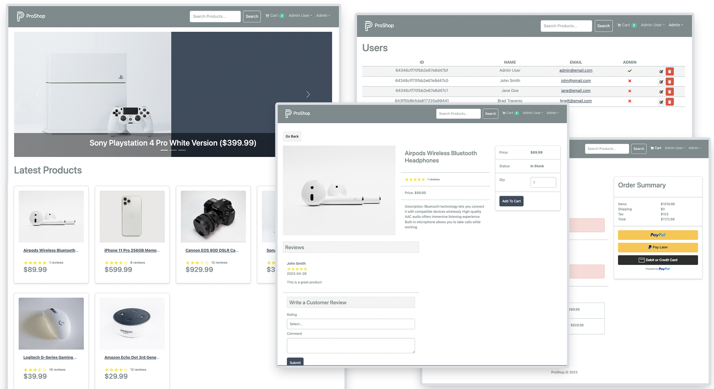

<h1 align="center">

[Fullstack Next.js E-commerce](https://mern-ecommerce-daljeet.vercel.app/)

</h1>

## Technologies 🔧

- Next.js(React)
- TypeScript
- Prisma
- NextAuth
- Stripe
- Tailwind
- React Query
- Sentry
- Yup


## Screenshots 📸

<br>




<br>


## Code Example/Issues 🔍

If you have any issues, please let me know in the issues section or directly to daljeet8085@gmail.com

## Installation 💾

```bash
git clone https://github.com/Daljeet-sandhu/MERN_Ecommerce.git
```

Fill your `.env` variables:

```
POSTGRES_USER=
POSTGRES_PASSWORD=
POSTGRES_DB=
DATABASE_URL="postgresql://<POSTGRES_USER>:<POSTGRES_PASSWORD>@<POSTGRES_HOST>:<POSTGRES_PORT>/<POSTGRES_DB>?schema=public&sslmode=prefer"
GITHUB_SECRET=
GITHUB_ID=
SECRET=
NEXTAUTH_URL=
NEXTAUTH_CALLBACK_URL=
NEXT_PUBLIC_STRIPE_PUBLISHABLE_KEY=
STRIPE_SECRET_KEY=
NEXT_PUBLIC_STRIPE_SUCCESS_REDIRECT_URL=
NEXT_PUBLIC_STRIPE_ERROR_REDIRECT_URL
```

Install deps:

```bash
npm install
```

Generate Prisma Client:

```bash
npx prisma generate
```

Run docker-compose:

```bash
docker-compose up -d
```

Run Next dev server:

```bash
npm run dev
```
